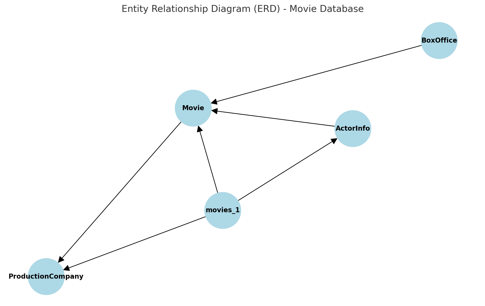

# 🎬 Movie Database Analysis Project

This project explores and analyzes a relational database containing comprehensive movie industry data, including movies, actors, box office revenue, and production companies. The database schema is built using SQLite and includes multiple related tables.

## 🗂️ Dataset Overview

The database (`module11-1.db`) consists of the following tables:

- **`movies_1`**: Contains information related to various movies.
- **`ActorInfo`**: Includes data about actors involved in movies.
- **`BoxOffice`**: Captures box office performance metrics.
- **`Movie`**: A central table describing movie metadata.
- **`ProductionCompany`**: Lists production companies associated with films.

## 🧾 Entity Relationship Diagram (ERD)

The diagram below shows how the tables are connected:

## 🧪 Objectives

- Understand database schema and relationships between tables.
- Perform SQL queries to:
  - Retrieve and join data across tables.
  - Summarize actor and box office information.
  - Analyze production company involvement.
- Gain hands-on experience with database exploration using SQLite.

## 🛠️ Technologies Used

- **SQLite** — For relational database management  
- **Python (pandas, sqlite3)** — For database interaction and analysis  
- **Jupyter Notebook** — For querying and visualizing results

## 🧠 Author  
**Mohammed Saif Wasay**  
*Data Analytics Graduate — Northeastern University*  
*Machine Learning Enthusiast | Passionate about turning data into insights*  
🔗 [Connect with me on LinkedIn](https://www.linkedin.com/in/mohammed-saif-wasay-4b3b64199/)
